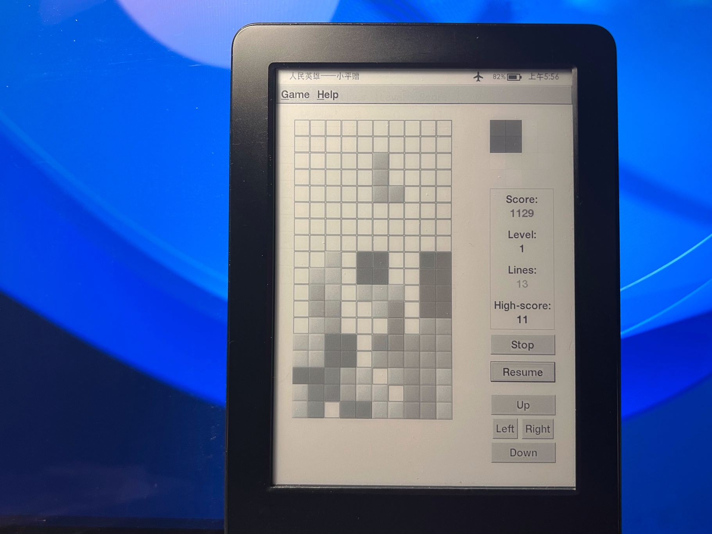

## GtkTetris

A simple Tetris clone for the GTK library.

**This is a port for kindle. Only tested with kt2(kindle7) 5.12.2.2**




## Installation

- Jailbreak your kindle
- Install [KUAL](https://www.mobileread.com/forums/showthread.php?t=203326)
- Download [release file](https://github.com/xfangfang/gtktetris_kindle/releases) and unzip its contents to extensions folder on your kindle

## Build Requirements

- Build for pc: GTK 2 >= 2.14
- Build for kindle: `Docker` or `gcc-4.7-arm-linux-gnueabi` (or other `Cross Toolchain` which glibc <= 2.20)

## Build for pc

- Install dependency
  - debian: `sudo apt install libgtk2.0-dev`
  - macOS: `brew install gtk+`

- Build and Run

  ```shell
  ./configure --enable-gtk2
  make clean && make
  cd src && ./gtktetris
  ```

## Build for kindle

- copy system lib from kindle(You can use the built-in SSH server of [koreader](https://github.com/koreader/koreader) or use other methods to copy `/usr/lib` to your pc.)


  ```shell
  # Copy /usr/lib to this project
  ssh -p <your_kindle_ssh_port> root@<your_kindle_ip> "cd /usr && tar -cpvzf /mnt/us/libs.tar.gz lib"
  # It's a Upper "P" in "scp -P ..."
  scp -P <your_kindle_ssh_port> root@<your_kindle_ip>:/mnt/us/libs.tar.gz `pwd`
  tar -xzvf libs.tar.gz
  ```

- Run a docker container to build for kindle, You can find the Dockerfile in the root directory of this project.

  ```shell
  # Start a container
  docker run -it --rm -v `pwd`:/src xfangfang/gcc-4.7-arm-linux-gnueabi /bin/bash

  # Inside the docker container
  ./configure --enable-gtk2 --host=arm-linux-gnueabi
  echo "LDFLAGS =  -L/usr/arm-linux-gnueabi/lib -L/src/lib" >> config.mk
  echo "GTK_LIBS =  -lgtk-x11-2.0 -lgdk-x11-2.0 -lXrender -lXinerama -lXext -lgdk_pixbuf-2.0 -lpangocairo-1.0 -lXdamage -lXfixes -latk-1.0 -lcairo -lpixman-1 -lpng16 -lxcb-shm -lxcb-render -lX11 -lxcb -lXau -lXdmcp -lgio-2.0 -lpangoft2-1.0 -lpango-1.0 -lfontconfig -lfreetype -lz -lexpat -lgobject-2.0 -lffi -lgmodule-2.0 -lgthread-2.0 -lglib-2.0 -lstdc++" >> config.mk

  make clean && make
  ```

# Reference

[Simple GTK tetris game](https://github.com/wader/gtktetris)  
[here's how to compile a gtk native app for the kindle touch](https://www.mobileread.com/forums/showthread.php?t=189372)
